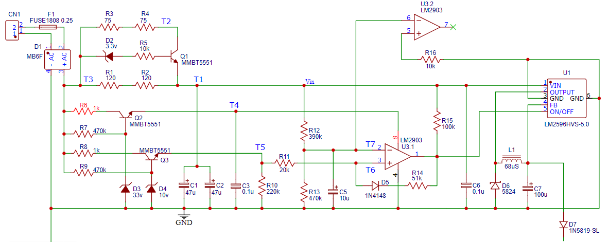

# Hardware

I adapted the circuit proposed by plusvic by modifying it to fit the situation of my condominium system and the needs of esphome.
The open circuit voltage I detect on the bus wires is about 35V, and the data signal is superimposed on the DC voltage.

The exchange of information (commands) between indoor and outdoor station is through a 25kHz modulated data signal, in my case of peak-to-peak amplitude varying from 0.5V to 5V depending on the distance of the device that is transmitting.
When audio/video communication is initiated, an additional high-frequency signal is added.

 

[Schematic here](schematic_2.5.pdf)

## Power supply and filtering

The circuit has the option of being powered directly from the bus.

I decided to use a wide-range input switching regulator, LM2596HVS-5.0, which supports up to 60v input and gives 5v output.

The whole circuit draws about 20mA from the bus line, which increases to 160mA during data transmission.

I placed a 250mA fuse at the input to protect the circuit, followed by a rectifier bridge.

Power for the switching module is taken downstream from an RC low-pass filter, formed by R1, R2, R3, R4, and C1, C2, which eliminates fluctuations due to data transmission. 

Since the circuit must work well over a wide voltage range, the resistor value is "dynamic."
R1 and R2 are directly placed in series with the load.
When the voltage at the ends of R1 and R2 is greater than 2.5v, the resistor branch formed by R3 and R4 is gradually placed in parallel.
This causes the value of the overall resistance to vary linearly from 240Ω to 80Ω, adjusting automatically according to the current flowing through them.

### Power supply protection

The bus voltage may vary depending on the system.
Normal values for a video system are about 32-38v.
Some times they operate with voltages around 25v.

The switching regulator suffers from low bus voltages.
When the input voltage decreases, it requires more current from the bus to compensate.
But requiring more current generates more drop on the filter resistors, so the input voltage to the switching drops and the system collapses.
With wemos consumption, the situation becomes unstable below 18v from the bus.
 
In some systems on restarting the power supply creates a soft start, so sometimes the voltage can be below 18v.
To protect the circuit, I added a protection stage that enables the switching regulator under certain conditions.

The heart of this circuit is a comparator made with LM2903. It compares the voltage across the capacitors feeding the switching integrated with a reference obtained with zener stabilization. there is also a hysteresis. The circuit enables the switching integrated when the input voltage is at least 20.5v and when it is stable for a few seconds.
After enabling it, the turn-off threshold is lowered by D5, R14 to about 18v.
In this way, the circuit never becomes unstable.

If the system works with low voltages (around 21-22v), more stability can be achieved by shorting R1.
In this case the shutdown threshold is lowered by a couple of volts and the system remains stable.

## Data receiving section

As in the circuit I was inspired by, the data signal is picked up from the bus by a high-pass type filter, in the schematic consisting of R20 and C8, 10kΩ and 1nF, respectively.

The filter has a cutoff frequency of about 15kHz, sufficient to reduce interference due to baseband audio communication.

The signal at the ends of the resistor is then given as input to a dual LM2903 comparator with an open collector type output.

The threshold against which the signal is compared is variable, depending on how output D5 is set.
In this way the input sensitivity can be adjusted to two levels according to the plant situation; sometimes the bus may receive interference.

To simplify signal reception by the Wemos, I decided to insert a monostable stage, eliminating the 25-kHz carrier and taking advantage of the second comparator already on board the LM2903.

In the presence of a signal, the output of the first comparator is brought low by discharging the 10nF capacitor C9; in the absence of a signal, the capacitor is charged through the 220kΩ resistor R24.

The voltage at the ends of the capacitor is compared with a second fixed voltage obtained from the same divider used on the first stage.
The output of the second comparator is sent to the Wemos, which will then have data packets stripped of carrier oscillation as input.

In the presence of any input signal, the output of the second comparator remains high for an additional 1.5ms beyond the time the signal on the bus remains high.
A time of 20µs would have sufficed to demodulate the command carrier, but increasing the timing this much allowed me to reduce the pickup of additional signals present on the bus, which disrupt the reception and decoding of commands.

## Data transmission section

Data transmission is accomplished by creating a pulse absorption on the bus, modulated at 25kHz, with the timing dictated by the communication protocol.
A digital pin of the wemos drives an NPN transistor, which must support voltages of at least 40v and currents of at least 150mA.

The current flowing through the transistor is set by the value of the resistor placed on the collector.
I chose to connect two 470Ω resistors in parallel to divide the power dissipation.

With higher resistor values, the commands sent by the wemos are not always received correctly.

