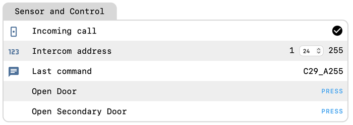
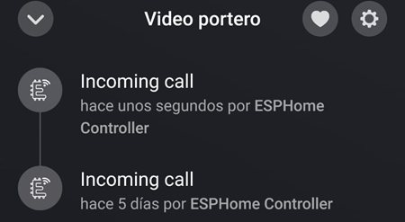
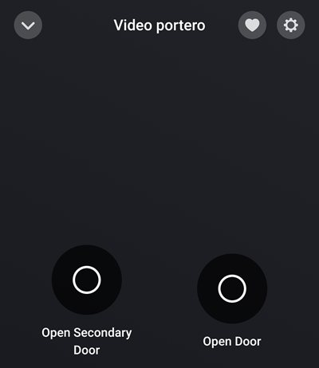

# Using the board with Homey Pro

The board does not need Home Assistant: Homey Pro talks to it directly over the ESPHome API.
This guide was tested on a Comelit 6741W monitor (Simplebus 2) with the stock pre-flashed firmware.
Thanks to Eladio for trying it out and sharing his setup.

## 1. Connect the board to your Wi-Fi

Same as in the [first set-up](README.md#first-set-up): connect the board to the bus, join the
`comelit-default` Wi-Fi network and enter your own network in the page that pops up.

Tip: reserve a fixed IP address for the board in your router, Homey connects to it by IP.

## 2. Set your intercom address

Homey does not show the **Intercom address** setting, so set it from the board's own web page:

- Open [http://comelit-default.local/](http://comelit-default.local/) (or the board's IP address).
- Press a button on your intercom: **Last command** and the log show it as `C<command>_A<address>`,
  for example `C16_A24`. The number after `A` is your address.
- Type that number into **Intercom address**. It is kept across reboots.

Until the address is set, **Incoming call** never turns on.

## 3. Add the board to Homey

- Install the **ESPHome Controller** app. There are several ESPHome apps for Homey, this is the one
  that works.
- Add the device manually: enter the board's IP address and port `6053`, then scan its entities.

Homey shows four entities:

- **Incoming call**: turns on when someone calls your intercom, and off again after 30 seconds.
- **Open Door**: opens the main door.
- **Open Secondary Door**: opens the secondary door.
- **Last command**: the last command seen on the bus.

## 4. Create your flows

- **Doorbell notification**: use **Incoming call** turning on as the trigger, and send a push
  notification to the phones you want.
- **Open the doors**: press **Open Door** or **Open Secondary Door** from the device page in Homey,
  or use them as actions in a flow.

## Troubleshooting

- **Incoming call never turns on**: the intercom address is not set, see [step 2](#2-set-your-intercom-address).
- **"Cannot send command: client not connected"** when pressing a door button: restart the
  ESPHome Controller app in Homey.
- **`Home Assistant event 'esphome.comelit' dropped`** warnings in the board's log: this is normal
  without Home Assistant and can be ignored.
