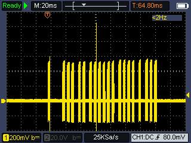

# Communication protocol

The exchange of information between the various devices takes place via a protocol based on a 25Khz carrier. Such a carrier is always sent for 3ms. The duration of "silence" between two transmissions determines the value of the transmitted bit; 3ms corresponds to "0," 6ms corresponds to "1."

The transmission always begins with a 3ms pulse, followed by a 16ms silence.

Then 18 bits are sent, divided as follows:

The first 6 bits indicate the command, again starting with the least significant bit.

the next 8 bits indicate the address. The least significant bit is transmitted first.

the next 4 bits are checksum, they simply indicate the number of bits to 1 sent in the previous fields.

For example, when I call an indoor intercom from the door station, the command 50 is sent. Suppose we call intercom #21:

Command 50 = 110010
Address 21 = 00010101
Checksum 6 = 0110
The bit sequence sent is then 010011 10101000 0110

The decoding of the protocol was done by [plusvic](https://github.com/plusvic) and his explanation [can be found here](https://github.com/plusvic/simplebus2-intercom?tab=readme-ov-file#how-it-works)

Commands formatted in this way are then sent on the bus line to all internal and external intercoms.

A command is also sent when a request is made from the apartment station to activate video communication when there is no call (command 20), when the main door is commanded to open (command 16), when the secondary door is commanded to open (command 29), when an apartment station receives the "out of door" call, when audio conversation is initiated or interrupted, when the call goes into timeout, etc.

## List of commands

| Command | Description                                                                                                                                  |
|---------|----------------------------------------------------------------------------------------------------------------------------------------------|
|    8    | Sent from intercoms to call the main switchboard                                                                                             |
|    9    | Sent from intercoms to call the caretaker phone (K)                                                                                          |
|    16   | Open building's entry door (AP). Sent when the intercom's open door button is pushed. Address tells who's opening the door                   |
|    17   | Sent when the user hooks off the intercom's handset                                                                                          |
|    18   | Sent when the user hooks on the intercom's handset.                                                                                          |
|    19   | Send from intercoms to call the secondary switchboard.                                                                                       |
|    20   | Turns on the video camera and the intercom's screen                                                                                          |
|    21   | Sent when the external switch connected to the CFP terminals is closed                                                                       |
|    24   | Sent by one intercom to call other intercomms (INT)                                                                                          |
|    26   | After sending 24, three consecutive 26 is sent.                                                                                              |
|    29   | Activates a generic actuator. In some configurations used to turn on staircase lights, open secondary doors without intercom, open car gates |
|    30   | High prioritary call to main switchboard (PAN)                                                                                               |
|    32   | Sent from switchboard 1 for calling an intercom                                                                                              |
|    37   | Sent from switchboard 2 for calling an intercom                                                                                              |
|    42   | Sent from switchboard 3 for calling an intercom                                                                                              |
|    43   | Sent from switchboard 4 for calling an intercom                                                                                              |
|    45   | Sent from switchboard 5 for calling an intercom                                                                                              |
|    48   | Sent when someone calls at the building's entry in an audio only system                                                                      |
|    50   | Sent when someone calls at the building's entry in a video system                                                                            |
|    51   | Start blinking open door button                                                                                                              |
|    52   | Stop blinking open door button                                                                                                               |
